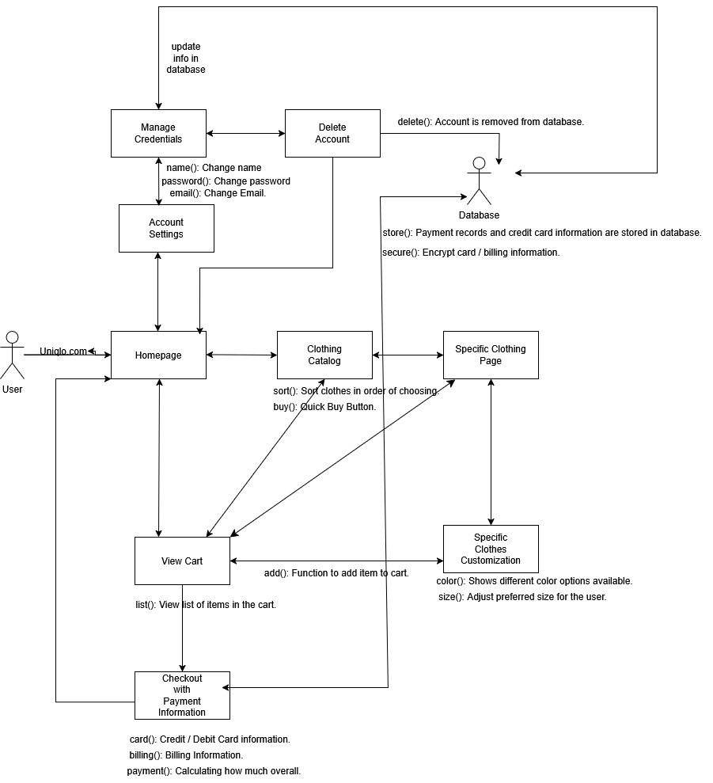

# Discussion 1 - Group 10

## Anderson Pham, Dean Martin Solideo, Eymard Alarcon, Marc Rodriguez

# Uniqlo

## Vision Statement:
This brand is for consumers who want a specific and wide variety of items to purchase from. The product or brand name is Uniqlo, which offers clothing. That allows users to find what they are looking for, in terms of its size. Unlike other similar products, we strive to provide our products with all sizes that best fit each and every one of our customers.

### Functional Requirements:

ID: UC - 1  
When going to uniqlo.com, direct user to homepage
When user’s browser lands on domain, direct to homepage

ID: UC - 2  
When user clicks on clothing while on catalog page, direct user to it’s page
When user is on catalog page browsing clothes and clicks on one, direct to specific page

ID: UC - 3  
Provide cart functionality for user
When user is on specific clothing page allow user to click “Add to cart” button if they have filled out clothing specifics, then store specific clothing’s data as well as customer’s specifications into a cart that memorizes it even if user leaves domain/page

ID: UC - 4  
Allow user to pay for clothes
When user is on cart page and presses “Checkout” button, direct user to payment page that allows user to input in credit or debit card information, send order to online database to process and bill user

ID: UC - 5  
Allow users to manage their account name, password, and email
When user is on homepage and clicks on “Account” button, direct user to account page that allows them to change their name provided it isn’t already in online database, change password provided they are prompted to input their old password and correctly match, and email provided they are prompted with a code sent to their registered email and correctly match
If successful change, delete old user info from old database and input new information

ID: UC - 6  
Allow to user to delete account
When user is on account page and clicks “Delete” button, prompt user for confirmation and if they click “Yes”, wipe user’s name, password, email from online database

ID: UC - 7  
Display clothing in an ordered catalog
When user is on homepage and clicks “Catalog” button, display cloth database ordered in rows with three top pieces on the left and three bottom pieces on the right and allow user to scroll up and down through it

ID: UC - 8  
Allow user to customize clothing when on specific page
When user is on a clothing’s specific page, provide drop down buttons that provide options for color and size

ID: UC - 9
Allow user to navigate to cart from homepage catalog page, and specific clothing page

## Non-functional Requirements:

ID: IC - 1  
Fast online navigation through clothing catalog
When user is on catalog, display all pieces of clothing in under 0.5 seconds
When user clicks on a clothing item on catalog, display specific clothing page in under 0.5 seconds

ID: IC - 2  
Secure user payment data to enforce privacy
When user first inputs card information in checkout and it is stored in the online database, ensure only admin has access to it

ID: IC - 3  
Intuitive UI for easy usage
Website can only show clothing catalog, clothing page, clothing specification, account page and details, and abstracts all other unnecessary information

ID: IC - 4  
Performance under heavy user traffic
Website and database should be able to handle 10,000 concurrent users interacting

ID: IC - 5
Scalability for adding future clothing release
Database and website format should easily accommodate adding new clothing

	
